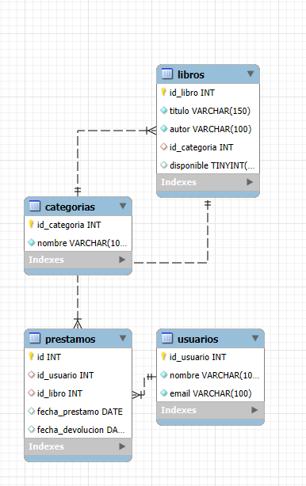
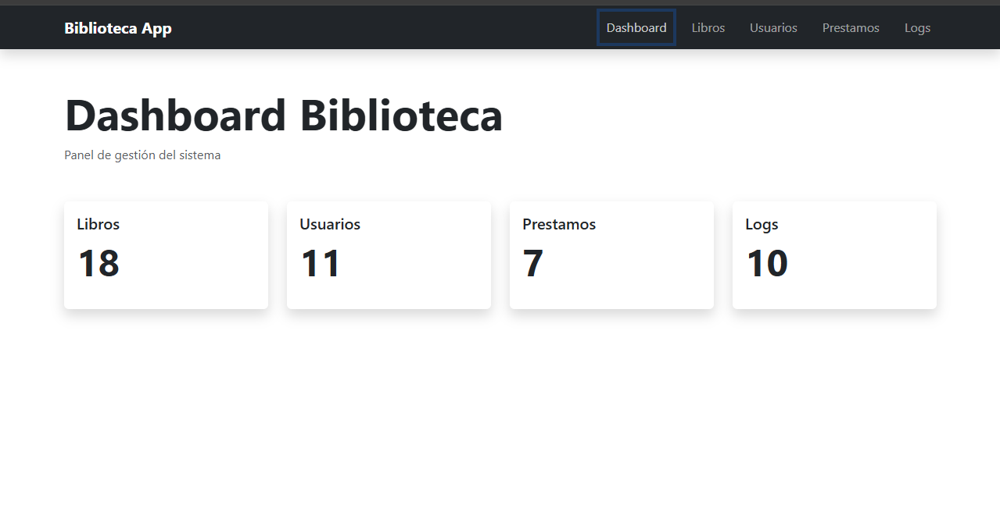
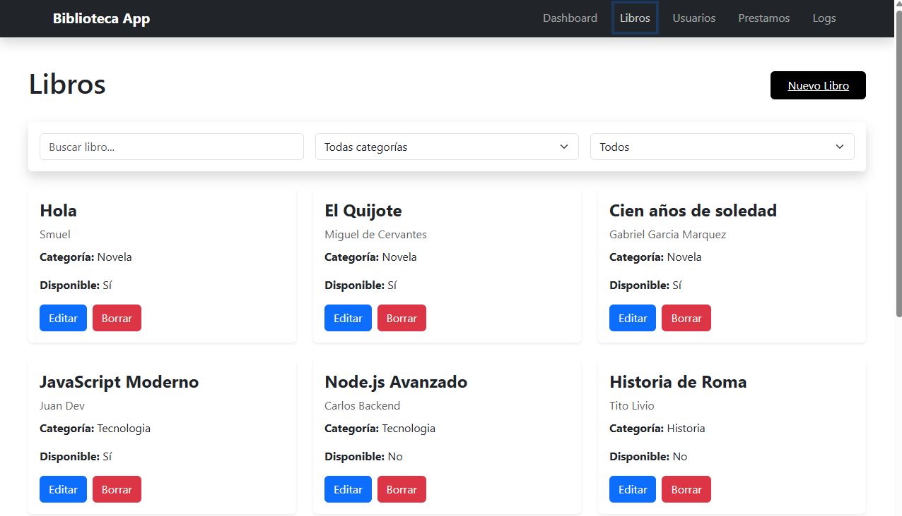
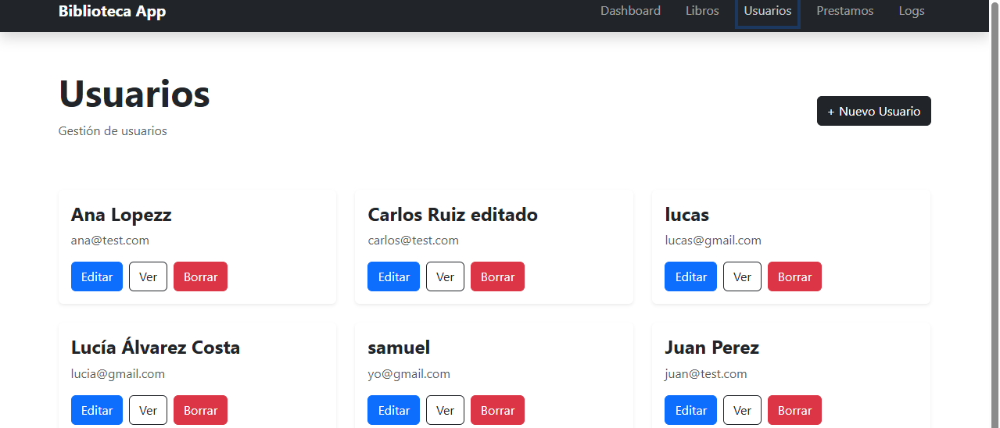
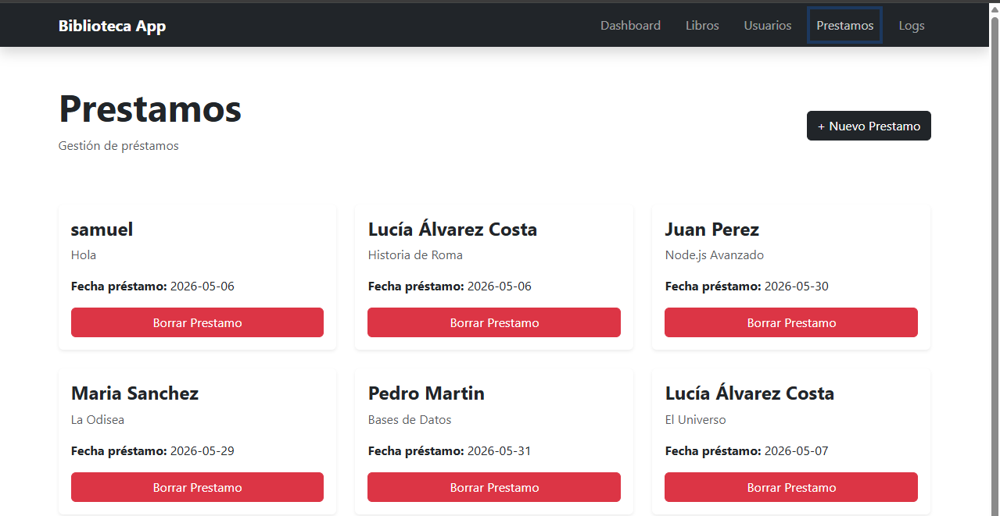
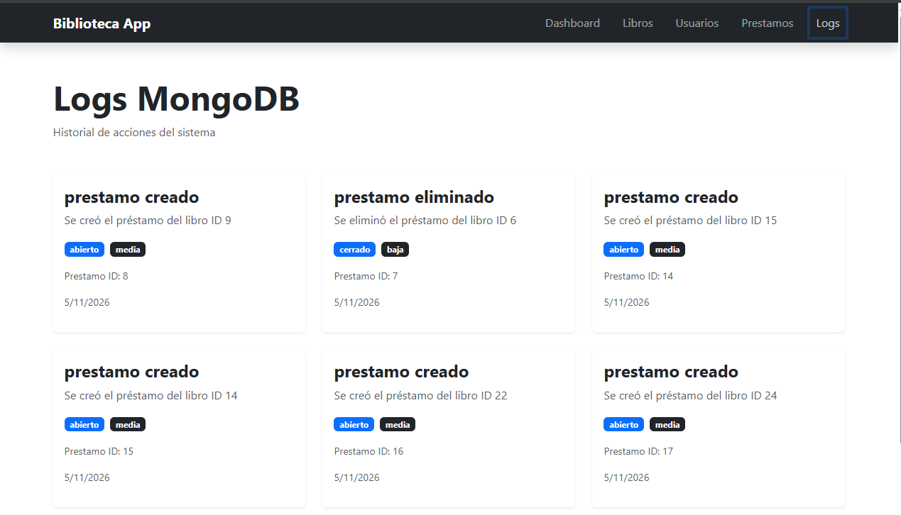
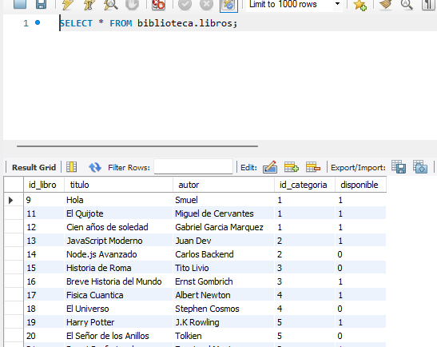
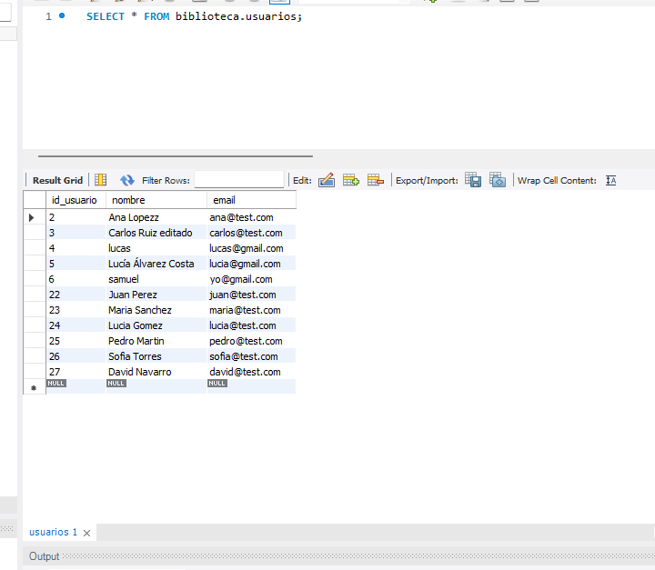
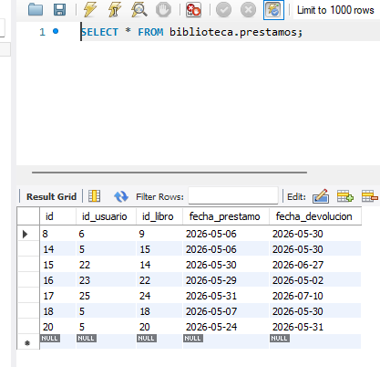
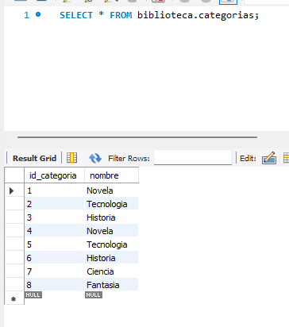

#  Biblioteca App

Aplicación web completa para la gestión de una biblioteca desarrollada con Next.js, MySQL y MongoDB.

---

##  Tecnologías utilizadas

- Next.js 16
- React
- Bootstrap 5
- MySQL (AWS RDS)
- MongoDB Atlas
- Sequelize ORM
- Mongoose ODM
- Vercel

---

##  Funcionalidades principales

### Gestión de libros
- Crear libros
- Editar libros
- Eliminar libros
- Buscar y filtrar libros
- Gestión de disponibilidad

###  Gestión de usuarios
- Crear usuarios
- Editar usuarios
- Eliminar usuarios
- Ver perfil de usuario
- Ver préstamos asociados

###  Gestión de préstamos
- Crear préstamos
- Eliminar préstamos
- Actualización automática de disponibilidad

###  Logs MongoDB
- Registro automático de acciones
- Historial de préstamos
- Persistencia NoSQL

---

##  Base de datos

## 📊 Diagrama Relacional MySQL

### MySQL
Base de datos relacional con:
- libros
- usuarios
- prestamos
- categorias

### MongoDB
Colección:
- logprestamos

---

##  Arquitectura

- Frontend y Backend con Next.js App Router
- API REST usando Route Handlers
- Sequelize para MySQL
- Mongoose para MongoDB
- Bootstrap para interfaz visual

---

##  Capturas

### Dashboard

---

### Libros

---

### Usuarios

---

### Préstamos

---

### Logs

##  Capturas Base de Datos

### Tabla libros

---

### Tabla usuarios

---

### Tabla prestamos

---

### Tabla categorias

---

### Colección MongoDB

## URL Vercel

https://biblioteca-app-nu.vercel.app